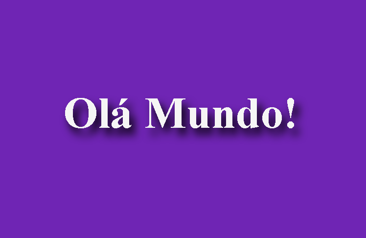

# 📌 Hello Django

Iniciando aplicação com o framework Django

## 🛠 Pré-requisitos

Antes de começar, você vai precisar ter instalado em sua máquina as seguintes ferramentas:

 - [`Git`](https://git-scm.com)
 - [`Python`](https://www.python.org/). 

Além disto é bom ter um editor para trabalhar com o código como [VSCode](https://code.visualstudio.com/)

## 📷 Screenshots

<p align="center" style="display: flex; align-items: flex-start; justify-content: center;">
  
</p>

---

## 🚀 Como executar o projeto

```bash

# Clone este repositório
$ git clone git@github.com:veras-dan/hello_django.git

# Rode o python em um servidor local
$ python manage.py runserver

# Abra usando esse caminho
$ http://127.0.0.1:8000/hello

```

## 📝 Contribuindo

> Contribuições são sempre bem-vindas! Caso tenha alguma dúvida confira este [`guia de como contribuir no GitHub`](./CONTRIBUTING.md).

## ✍🏻 Autores

<a href="https://github.com/veras-dan">
 
 <br />
 <sub><b>Dan Veras</b></sub></a>
 <br />

---

## 📖 Contatos 

Alguns canais para entrar em contato:

[](https://discord.com/users/Dan#5690)
[](https://twitter.com/veras_dan) 
[](https://www.linkedin.com/in/verasdanilo/) 
[](mailto:dveras1623@gmail.com)

## 📝 Licença

Este projeto esta sobe a licença [`MIT licensed`](./LICENSE).